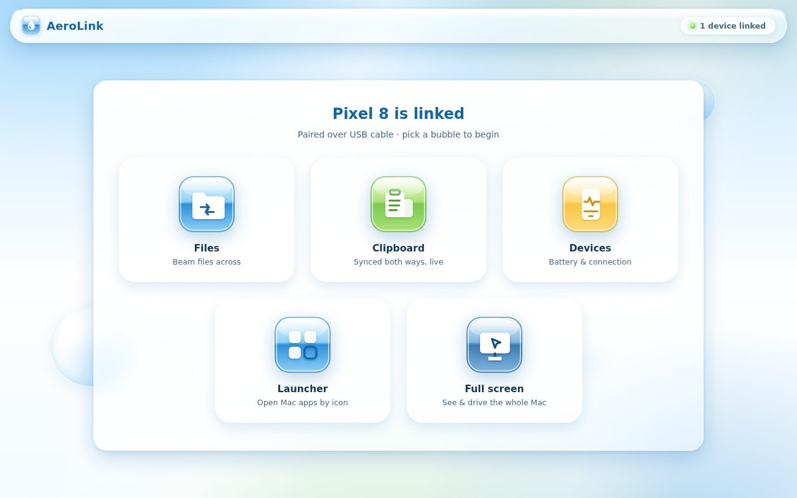
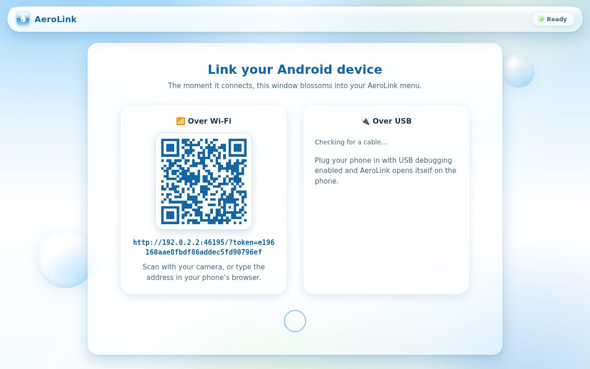
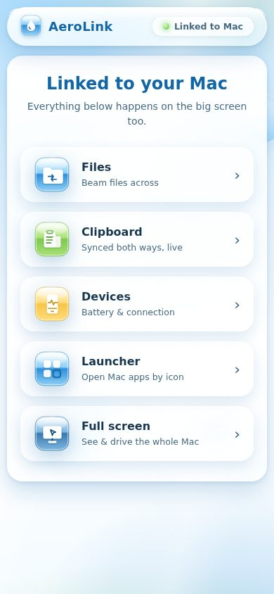
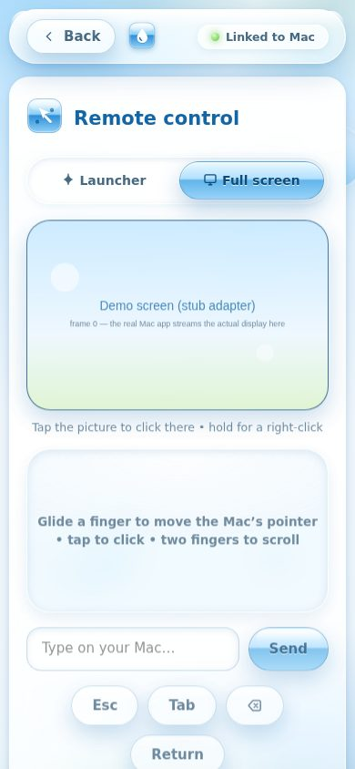

# AeroLink 💧

Link your **Android phone** to your **Mac** — and watch the Mac app blossom
into a glossy **Frutiger Aero** menu the moment the phone connects.

One codebase, two faces:

- **On the Mac** (Electron): a white-glass desktop menu of big gel icons —
  sky gradients, drifting bubbles, the whole mid-2000s optimism.
- **On the phone** (any modern browser, installable as a PWA): the *same app*
  in a simplified single-column layout tuned for small screens.



| Pairing on the Mac | The phone menu | Full-screen remote |
|---|---|---|
|  |  |  |

## What it does

| Bubble | Feature |
|---|---|
| **Files** | Beam files both ways — drag & drop on the Mac, tap to pick on the phone, live progress bar. Files land in `~/Downloads/AeroLink/` on the Mac. |
| **Clipboard** | Truly bidirectional: copy on the Mac and it appears on the phone *by itself* (the server watches the Mac clipboard), push text the other way with Send or one-tap **Paste & send**. |
| **Devices** | Glossy dashboard cards: phone name, battery, network, screen, and whether it's linked over Wi-Fi or USB. |
| **Launcher** | Remote-control mode 1 — the Mac's installed apps as gel icons on a white Frutiger Aero sheet. Tap one, it opens on the Mac (`open -a`). Searchable. |
| **Full screen** | Remote-control mode 2 — the *whole* Mac display streamed live to the phone. Tap the picture to click exactly there, hold for a right-click; trackpad, typing, arrow/return/esc keys, media play/pause & skip, and volume sit underneath. |

## Pairing — two ways

1. **Wi-Fi + QR** — launch AeroLink on the Mac; it shows a QR code. Scan it
   with the phone's camera (both devices on the same network). The QR embeds a
   per-launch pairing token, so random devices on your network can't join.
2. **USB cable** — plug the phone in with *USB debugging* enabled
   (Settings → Developer options). If `adb` (Android platform-tools) is
   installed on the Mac, AeroLink sets up `adb reverse` and opens itself on
   the phone automatically. No adb? Wi-Fi still works.

## Using AeroLink from your phone

Once paired, AeroLink runs in your phone's browser (Chrome or any modern
browser) as a simplified single-column app. The pairing token is saved
locally, so a reload stays linked — and you can **Add to Home screen** to
install it as a PWA. Then tap a bubble:

- **Files** — tap **Tap to choose files** to send one to the Mac (it lands in
  `~/Downloads/AeroLink/`). Files sent *from* the Mac appear in the list; tap
  **Save** to download. A gel progress bar tracks each transfer both ways.
- **Clipboard** — type text and tap **Send to the Mac**. Anything you copy on
  the Mac shows up here by itself. **Paste & send** grabs the phone's clipboard
  and beams it over in one tap.
- **Devices** — a dashboard of your phone's battery, network, and screen,
  shared live with the Mac.
- **Launcher** — a searchable grid of the Mac's apps as gel icons; tap one to
  open it on the Mac.
- **Full screen** — a live view of the whole Mac display. **Tap the picture to
  click there, hold for a right-click.** Underneath sit a trackpad (glide to
  move the pointer, tap to click, two fingers to scroll), a field to type on
  the Mac, and key / media / volume buttons.

A few things worth knowing:

- **Remote control** (Launcher, Full screen, trackpad, keys) only drives a
  **real Mac** — against the demo/dev server it reports "Remote control
  requires the macOS host app." It also needs the Mac's Screen Recording /
  Accessibility permissions (and `cliclick` for pointer control) — see
  [macOS permissions](#macos-permissions) below.
- **Clipboard over Wi-Fi:** Android Chrome blocks automatic clipboard *reads*
  on plain-HTTP LAN pages, so **Paste & send** may need you to long-press the
  box and paste manually, then Send. **USB pairing avoids this** (it runs over
  `localhost`, which gets the full clipboard API). Mac → phone auto-sync always
  works either way.
- **Slow connections:** the live screen adapts by itself. Each frame is
  acknowledged by the phone, so the Mac only sends the next one once the last
  arrived — stale frames are dropped, never queued — and the capture steps
  through three profiles (**HD → Balanced → Eco**: smaller, lighter, less
  frequent frames) based on how fast frames actually reach you. Frames where
  nothing changed on screen aren't sent at all. The **Eco** button under the
  live view pins the lightest profile if you want to spare data; the little
  badge next to it shows the profile currently streaming.

## Running it

```bash
npm install
npm start          # the Electron app (macOS: full features)
```

Build the macOS app (run **on a Mac**):

```bash
npm run dist:mac   # → dist/AeroLink-0.1.0.dmg (unsigned: right-click → Open on first launch)
```

Headless dev server (works on any OS, no Electron — great for hacking on the UI):

```bash
npm run dev:server
# prints a host URL and a phone URL; open both in browser tabs to watch the
# transformation live
```

### macOS permissions

- **Accessibility** (System Settings → Privacy & Security → Accessibility):
  needed the first time you use remote typing/keys.
- **Screen Recording** (System Settings → Privacy & Security → Screen Recording):
  needed for the Full screen mode's live view — macOS prompts on first use.
- **Pointer control** (trackpad + tap-to-click) needs
  [cliclick](https://github.com/BlueM/cliclick): `brew install cliclick`.
  Keyboard, media, volume, and the Launcher work without it.
- **Media keys** control Spotify or Apple Music (whichever is running).

## Tests

```bash
npm test           # protocol + HTTP + file-store unit/integration tests (node:test)
npm run test:e2e   # Playwright: transformation, responsive layouts, clipboard
                   # auto-sync, launcher grid, live screen frames
                   # (set CHROMIUM_PATH if Chromium isn't at /opt/pw-browsers/chromium)
```

The stub adapter (used by `npm run dev:server` and the tests) fakes the
macOS-only seams so everything is demoable anywhere: a twelve-app launcher
list and an animated SVG "screen" stream.

The README screenshots regenerate with `node scripts/screenshots.mjs`.

## How it's put together

```
src/server/   pure Node (never imports Electron): HTTP + WebSocket server,
              pairing tokens, file store, presence hub
src/client/   the web app served to BOTH the Electron window and the phone —
              Frutiger Aero design system, inline SVG gel icons, state machine
src/main/     Electron only: window, macOS clipboard/input adapter,
              osascript remote control, adb USB watcher
```

The Electron renderer is just another client of the local server — it
identifies as the host via a separate host-only token. Presence changes drive
the signature UI transformation (`waiting → menu`, with a 3-second grace
period absorbing phone reconnects).

### Security model (deliberately simple)

- Per-launch random pairing token in the QR/USB URL; all API and WebSocket
  access requires it (constant-time compared).
- A separate host token — LAN devices can't impersonate the Mac window.
- Filenames sanitized; uploads confined to the storage folder; 2 GB cap.
- Non-goals for now: TLS, multi-Mac, persistent auth across launches.

### Known limitations

- Android Chrome blocks `navigator.clipboard` on plain-HTTP LAN pages — the
  clipboard view's textarea + long-press is the fallback (USB pairing uses
  `localhost`, which gets the full clipboard API). Mac → phone auto-sync
  fills the textarea regardless.
- The live screen streams JPEG snapshots (~1.5 fps) — built for glanceable
  control, not video playback.
- Battery/network cards show “—” on browsers without those APIs.
- macOS-specific behavior (osascript, adb, desktopCapturer, the .dmg build)
  needs a real Mac.
